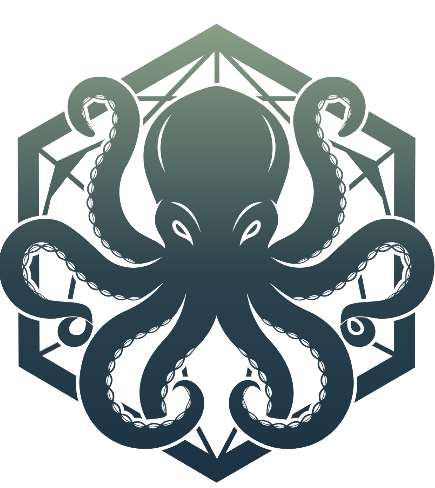

# Microservice Architecture

<p align="center">
  
</p>

Polygon Siphon is designed as a family of specialized pods sharing a
common scanning core. Each pod handles one class of data ingestion;
the scanning logic is identical across all of them.

## Pods

```
                         ┌─────────────────┐
                         │   Siphon-Core   │
                         │  (Rust library) │
                         └────────┬────────┘
          ┌──────────────┬────────┴────────┬──────────────┐
          │              │                 │              │
  ┌───────▼──────┐ ┌────▼──────┐ ┌────────▼─────┐ ┌──────▼──────┐
  │  Siphon-FS   │ │ Siphon-API│ │  Siphon-DS   │ │  Siphon-GW  │
  │File Scanner  │ │Sync API   │ │ Stream Input │ │Inline Proxy │
  │              │ │           │ │              │ │             │
  │PDF, DOCX,    │ │POST /scan │ │Syslog,       │ │HTTP/gRPC    │
  │archives,     │ │gRPC scan  │ │Fluent,       │ │scan+forward │
  │email, QR,    │ │req/resp   │ │AMQP, Redis   │ │or block     │
  │Parquet, ...  │ │           │ │Streams, SQS  │ │             │
  └──────────────┘ └───────────┘ └──────────────┘ └─────────────┘
          │              │                 │              │
          └──────────────┴────────┬────────┴──────────────┘
                                  ▼
                         ┌─────────────────┐
                         │ Unified Finding │
                         │   Wire Format   │
                         │     (JSON)      │
                         └─────────────────┘
```

### Siphon-Core

The shared library. Contains the scanner engine, patterns, validators,
normalization pipeline, context matching, scoring, and all detection
logic. Zero file-format dependencies — operates on `&str` input only.

**Crate:** `siphon-core`

**Modules:**
- `scanner` — parallel regex matching with Rayon + AC prefilter
- `patterns` — 583 compiled patterns across 128 categories
- `validation` — 72 checksum validators
- `normalize` — 10-stage evasion defense pipeline
- `context` — Aho-Corasick keyword proximity matching
- `scoring` — confidence computation + dedup
- `models` — `Match`, `PatternDef`, specificity scores
- `guard` — `InputGuard` (scan/redact/tokenize/obfuscate)
- `edm` — exact data match (HMAC-SHA256)
- `lsh` — document similarity (MinHash)
- `policy` — TOML-based policy engine
- `compliance` — PCI-DSS/HIPAA/SOC2/GDPR reports
- `audit` — HMAC-signed audit logging

### Siphon-FS (File Scanner)

Batch and on-demand file processing. Handles files on disk, in
archives, or from object storage (S3, GCS, Azure Blob).

**Crate:** `siphon-fs`

**Depends on:** `siphon-core` + `siphon-extractors`

**Responsibilities:**
- Text extraction from 20+ file formats (PDF, DOCX, XLSX, archives,
  email, QR codes, Parquet, SQLite)
- Directory traversal and recursive scanning
- Pipeline orchestration (extract → scan → report)
- CLI interface (`siphon scan`, `siphon scan-dir`)
- Bucket event triggers (S3 → scan new uploads)

**Ingestion:** filesystem, S3/GCS/Azure bucket events

### Siphon-API (Sync Scan Service)

Synchronous HTTP/gRPC endpoint. Apps POST text and receive findings
in the response. The simplest integration — no queue, no proxy, just
a function call over the network.

**Crate:** `siphon-api`

**Depends on:** `siphon-core`

**Responsibilities:**
- `POST /scan` — accept JSON body with text, return findings
- `POST /guard` — scan-and-redact in one call
- gRPC service with unary and streaming RPCs
- Per-tenant API key auth + rate limiting
- Request-level policy enforcement

**Ingestion:** HTTP/1.1, HTTP/2, gRPC

**Wire format:**
```http
POST /scan HTTP/1.1
Content-Type: application/json
Authorization: Bearer <api-key>

{
  "text": "My SSN is 425-71-3482",
  "options": {
    "min_confidence": 0.5,
    "categories": ["National IDs", "Credit Card Numbers"]
  }
}

→ 200 OK
{
  "findings": [...],
  "scan_duration_ms": 3
}
```

### Siphon-DS (Data Stream)

Async consumer for event streams. Multi-protocol adapter — speaks
the stream sources your infrastructure already uses. No single
protocol is the default.

**Crate:** `siphon-ds`

**Depends on:** `siphon-core`

**Ingestion adapters** (pick the ones you need at build time):
- **Syslog** (RFC 5424 UDP/TCP) — most enterprise apps, firewalls,
  routers already emit syslog
- **Fluent forward** — drop-in for Kubernetes log pipelines running
  Fluent Bit or Fluentd
- **AMQP** — RabbitMQ, enterprise message buses
- **Redis Streams** — lightweight, reuses existing Redis deployments
- **AWS SQS / GCP Pub/Sub / Azure Service Bus** — managed cloud queues
- **NATS** — cloud-native pub/sub
- **Kafka** — optional adapter, not the default
- **MQTT** — IoT and lightweight pub/sub

Each adapter is a feature flag. The core DS binary is protocol-agnostic;
adapters are compiled in as needed.

**Responsibilities:**
- Subscribe to configured streams
- Deserialize messages (JSON, plain text, syslog, etc.)
- Scan message body through `siphon-core`
- Emit findings to a findings sink (SIEM, another stream, HTTP webhook)
- At-least-once semantics with offset/ack discipline
- Back-pressure handling and lag monitoring

### Siphon-GW (Inline Proxy)

Reverse proxy that intercepts HTTP/gRPC traffic in-flight. Scans the
request body, then forwards, blocks, or redacts based on policy.

**Crate:** `siphon-gw`

**Depends on:** `siphon-core`

**Responsibilities:**
- HTTP/1.1, HTTP/2, gRPC reverse proxy
- Streaming body scan for large payloads
- Policy action: `forward`, `block`, `redact-and-forward`, `log-and-forward`
- mTLS termination
- Upstream health checks and load balancing

**Ingestion:** HTTP/1.1, HTTP/2, gRPC (as a reverse proxy)

**Difference from Siphon-API:** API is request/response — the client
knows it's talking to a scanner. GW is transparent — the client doesn't
know its traffic is being scanned. GW has upstream forwarding, circuit
breakers, and proxy semantics that API doesn't need.

## Detector Plugin Model

Regex is only one way to find sensitive data. Future detection types —
OCR, ML-based NER, document classifiers, image content analysis — fit
the same pipeline as long as they expose a common `Detector` interface.

```
                   ┌────────────────────┐
                   │  Detector (trait)  │
                   └─────────┬──────────┘
          ┌──────────────────┼──────────────────┐
          │                  │                  │
  ┌───────▼──────┐  ┌────────▼────────┐  ┌─────▼─────────┐
  │Regex Detector│  │  ML Detector    │  │Classifier     │
  │  (in-proc)   │  │  (remote gRPC)  │  │  (remote gRPC)│
  │              │  │                 │  │               │
  │583 patterns  │  │BERT NER, PII,   │  │Doc type,      │
  │72 validators │  │custom models    │  │intent, toxic  │
  └──────────────┘  └─────────────────┘  └───────────────┘
```

### The Detector trait

```rust
pub trait Detector: Send + Sync {
    fn name(&self) -> &str;
    fn version(&self) -> &str;

    /// Scan input and return findings.
    async fn detect(&self, input: &DetectorInput) -> Result<Vec<Finding>>;

    /// What this detector looks for. Used for routing and reporting.
    fn categories(&self) -> &[&str];

    /// Is this detector healthy? Used for circuit breaking on
    /// remote detectors.
    async fn healthy(&self) -> bool { true }
}

pub struct DetectorInput {
    pub text: Option<String>,
    pub bytes: Option<Vec<u8>>,          // for image/binary detectors
    pub mime_type: Option<String>,
    pub metadata: HashMap<String, String>,
}
```

Detectors are **composable**. A scan request runs through every
configured detector in parallel (or sequentially if there are
dependencies), findings are merged, deduplicated, and reported.

### Local vs Remote Detectors

**Local detectors** run in-process inside the calling pod:
- Regex + validators (current behavior)
- Simple heuristics (entropy, LSH)
- Lightweight rule-based classifiers

**Remote detectors** run in their own pods and are called over gRPC:
- ML models that need GPUs (Siphon-ML, Siphon-Vision)
- Models with large memory footprints (transformer-based NER)
- Shared models used by many caller pods

The caller pod (FS, API, DS, GW) holds a list of configured detectors
— some local, some remote — and calls them in parallel. Remote
detectors have retry, timeout, and circuit-breaker logic.

## Detector Pods

### Siphon-ML (ML-based Detection)

Transformer-based detectors for PII, NER, and custom fine-tuned
models. Runs on GPU nodes. Exposes a gRPC service that any caller
pod can use.

**Crate:** `siphon-ml`

**Depends on:** `siphon-core` (for finding types) + ONNX Runtime or
`candle` for model inference

**Responsibilities:**
- Host one or more ML models (e.g., HuggingFace BERT-NER, Presidio,
  custom fine-tuned models)
- gRPC endpoint: `Detect(text) → findings`
- Model versioning and A/B routing
- Batch inference for throughput
- Warm pool of loaded models

**Use cases:**
- PII detection that regex misses (contextual names, addresses)
- Custom-trained models for industry-specific data (medical terms,
  legal documents)
- Zero-shot classification

### Siphon-Vision (OCR + Image Analysis)

Image and scanned-document understanding. Extracts text from images
and emits findings for visual content.

**Crate:** `siphon-vision`

**Depends on:** `siphon-core` + OCR engine (Tesseract, PaddleOCR, or
cloud API) + optional CV models

**Responsibilities:**
- OCR: image → text with bounding boxes and confidence
- Layout analysis: detect tables, forms, signatures
- Logo / watermark detection
- Face detection (PII category)
- Document classification (ID card, invoice, medical record)

**Finding extension:**
```json
{
  "source_pod": "siphon-vision",
  "findings": [{
    "category": "PII",
    "sub_category": "Printed SSN",
    "text": "425-71-3482",
    "confidence": 0.92,
    "metadata": {
      "bbox": [120, 340, 280, 360],
      "page": 1,
      "ocr_confidence": 0.98,
      "model_version": "tesseract-5.3.0"
    }
  }]
}
```

### Siphon-Classify (Document Classification)

Classifies whole documents or spans of text. Orthogonal to PII
detection — answers "what kind of document is this?" not "does it
contain PII?"

**Crate:** `siphon-classify`

**Depends on:** `siphon-core` + classification models

**Responsibilities:**
- Document type classification (contract, medical record, financial
  statement, source code, chat log, ...)
- Sensitivity classification (public, internal, confidential, secret)
- Intent detection (customer request, complaint, legal notice)
- Language detection
- Toxicity / harmful content classification

**Why it's separate from ML:**
- Different model families (classifiers vs. NER)
- Different output shape (labels + confidence, not spans)
- Can run on CPU where NER needs GPU

## Extended Pod Map

```
               ┌─────────────────────────────────┐
               │        Siphon-Core              │
               │  scanner + Detector trait       │
               └────────────────┬────────────────┘
    ┌─────────────┬─────────────┼─────────────┬──────────────┐
    │             │             │             │              │
Ingestion Pods    │        Detector Pods      │              │
(local detectors) │        (remote, gRPC)     │              │
    │             │             │             │              │
┌───▼──┐  ┌──────▼────┐  ┌─────▼─────┐  ┌───▼──────┐  ┌────▼────┐
│ FS   │  │ API       │  │ ML        │  │ Vision   │  │Classify │
│ DS   │  │           │  │ (GPU)     │  │ (OCR+CV) │  │         │
│ GW   │  │           │  │           │  │          │  │         │
└──┬───┘  └──────┬────┘  └───────────┘  └──────────┘  └─────────┘
   │             │           ▲               ▲             ▲
   └─────────────┴───────────┴───────────────┴─────────────┘
                    gRPC Detector protocol
```

Ingestion pods (FS, API, DS, GW) run local detectors (regex + validators)
and **optionally** call remote detector pods (ML, Vision, Classify)
based on configuration. A policy can say: "For HIPAA-regulated
uploads, run regex + ML + Vision and combine the findings."

### Pipeline Composition

A scan request can route through multiple pods:

```
Image upload (PDF scan of a form)
  │
  ▼
Siphon-FS: extract PDF → stream of page images
  │
  ▼
Siphon-Vision: OCR each page → text + bounding boxes
  │
  ▼
Siphon-Core (in FS): regex + validators → structural findings
  │
  ▼
Siphon-ML: contextual NER → name/address findings regex missed
  │
  ▼
Siphon-Classify: document type = "medical intake form"
  │
  ▼
Unified finding stream with provenance for each finding
```

Each step is optional and configurable per-policy.

## Model Registry (Future)

When multiple ML pods are running, a lightweight **model registry**
tracks:
- Deployed model versions per pod
- A/B routing weights
- Per-model accuracy metrics from labeled eval corpus
- Canary deployment state

The registry is a small config service, not a pod — a ConfigMap or
an external service like MLflow. Each detector pod loads its routing
rules at startup and can hot-reload.

## Siphon-C2 (Command & Control)

The management plane. Web UI and control API for administrators to
orchestrate, monitor, and manage the entire Siphon deployment. Not
on the data path — C2 never scans data itself, it only manages and
observes the pods that do.

**Crate:** `siphon-c2`

**Depends on:** `siphon-core` (for shared types) + axum + PostgreSQL
+ React frontend

**Architecture:**

```
                    ┌──────────────────┐
                    │   Siphon-C2      │
                    │  (Admin Web UI)  │
                    └─────────┬────────┘
                              │ mgmt API (gRPC/REST)
          ┌───────────┬───────┴────────┬───────────┐
          │           │                │           │
    ┌─────▼────┐ ┌───▼─────┐ ┌────────▼───┐ ┌────▼────┐
    │Ingestion │ │Detector │ │  Findings  │ │  Audit  │
    │  Pods    │ │  Pods   │ │   Store    │ │  Store  │
    └──────────┘ └─────────┘ └────────────┘ └─────────┘
```

### Capabilities

**Orchestration**
- Pod inventory: which ingestion/detector pods are deployed, version,
  health, replica count
- Scale up/down via Kubernetes HPA policies
- Configure detector routing: which ingestion pods call which detector
  pods, per tenant and per policy
- Hot-reload configuration without pod restarts

**Policy Management**
- Visual policy editor: drag-and-drop rules for PCI, HIPAA, GDPR,
  custom frameworks
- Action configuration: flag, redact, block, tokenize, obfuscate
- Per-tenant policy assignment
- Policy simulator: paste sample text, see what would fire

**Pattern & Rule Management**
- Browse 561 built-in patterns by category
- Create custom patterns with regex + validator picker
- Pattern tester: paste text, see which patterns match in real-time
- Enable/disable patterns per tenant

**Detection Assets**
- EDM management: upload known-sensitive values for exact matching
- LSH vault: register confidential documents for similarity detection
- Allowlists: suppress known false positives

**Model Registry** (when detector pods exist)
- Deployed ML/Vision/Classify models per pod
- Version history, rollback
- A/B routing weights
- Per-model accuracy metrics from labeled eval corpus
- Canary deployment controls

**Monitoring Dashboards**
- Live throughput: scans/sec per pod, MB/s
- Findings volume by category / sub_category / tenant
- FP/FN trends from labeled corpus re-runs
- Consumer lag for DS adapters (per protocol)
- GPU utilization for detector pods
- Circuit breaker states
- p50/p95/p99 scan latency per pod

**Live Findings Stream**
- SIEM-console-style view of findings as they happen
- Filter by tenant, category, severity, pod
- Drill-down: click a finding to see the source, context, policy
  action taken
- Export to CSV / SIEM

**Compliance Reporting**
- Auto-generated PCI-DSS, HIPAA, SOC 2, GDPR reports
- Evidence pack assembly (findings, audit logs, policy state)
- Scheduled delivery to auditors

**Identity & Access**
- User management (local accounts or SSO via OIDC/SAML)
- RBAC: Admin, Analyst, Operator, Viewer roles
- API key rotation and scope management
- Audit trail for every C2 action

**Testing**
- Blind test runner: trigger evadex-style FP/FN corpus runs
- Corpus regression dashboard: recall/FP history over time
- Pattern coverage reports

### Technology

- **Backend:** Rust (axum), gRPC clients to all pods, PostgreSQL for
  C2 state, Redis for session cache
- **Frontend:** React + TypeScript + shadcn/ui + Tailwind +
  Recharts. Clean, modern admin console
- **Live updates:** WebSocket for findings stream and live metrics
- **Deployment:** Single pod, stateless except for PostgreSQL
  connection. Can run behind any ingress

### What C2 is NOT

- **Not on the data plane.** C2 doesn't scan, redact, or forward
  user data. It only manages the pods that do.
- **Not a SIEM.** C2 shows findings, but long-term findings storage
  and correlation belong in a real SIEM (Splunk, Elastic, Datadog).
  C2 forwards findings there.
- **Not an auth server.** C2 uses your existing OIDC/SAML provider.
  It has local users only as a fallback for bootstrap.
- **Not critical path.** If C2 is down, the data plane keeps
  scanning. Pods hold their last-known-good config in memory.

## Which Pod Do I Use?

| Use case | Pod | Why |
|----------|-----|-----|
| Scan files on disk | FS | Has extractors |
| S3 bucket DLP monitoring | FS | Bucket events trigger file scan |
| App submits text, wants findings back | API | Sync HTTP call |
| Microservice needs scan during request processing | API (gRPC) | Low-latency RPC |
| Already running Fluent Bit in K8s | DS (fluent adapter) | Zero app changes |
| Enterprise apps emit syslog | DS (syslog adapter) | Zero app changes |
| RabbitMQ-based message bus | DS (amqp adapter) | Reuse existing infra |
| Outbound HTTP traffic monitoring | GW | Transparent interception |
| Air-gap blocking of egress | GW | `block` policy |
| Scanned documents / images | FS + Vision | Extract with OCR, then scan |
| Admin wants to manage policies | C2 | Web UI for orchestration |
| View live findings / dashboards | C2 | Management console |

## Crate Workspace Layout

```
polygon-siphon/
├── Cargo.toml                # workspace root
├── crates/
│   ├── siphon-core/          # scanner engine + Detector trait
│   ├── siphon-detect-proto/  # gRPC protobuf for remote detectors
│   ├── siphon-extractors/    # file format handlers
│   │
│   │   # Ingestion pods
│   ├── siphon-fs/            # file scanner binary
│   ├── siphon-api/           # sync HTTP/gRPC scan service
│   ├── siphon-ds/            # multi-protocol stream consumer
│   ├── siphon-gw/            # inline HTTP/gRPC proxy
│   │
│   │   # Detector pods (called via gRPC)
│   ├── siphon-ml/            # transformer-based NER and PII
│   ├── siphon-vision/        # OCR + image content analysis
│   ├── siphon-classify/      # document classification
│   │
│   │   # Management plane
│   ├── siphon-c2/            # admin web UI + control API
│   └── siphon-c2-ui/         # React frontend (or separate repo)
├── tests/
├── docs/
└── deploy/
    ├── helm/                 # one chart per pod
    └── docker/               # one Dockerfile per pod
```

## Unified Finding Wire Format

Every pod emits findings in the same JSON schema. Downstream consumers
(SIEM, dashboards, alerting) don't need to know which pod produced a
finding.

```json
{
  "source_pod": "siphon-api",
  "source_id": "req:7f3a9e2b-1c8d-4a5f-b6e9-0d3c4e5a7b2f",
  "timestamp": "2026-04-18T12:00:00Z",
  "findings": [
    {
      "category": "Credit Card Numbers",
      "sub_category": "Visa",
      "text": "4532****0366",
      "confidence": 0.95,
      "has_context": true,
      "span": [42, 58],
      "metadata": {
        "bin_brand": "Visa",
        "bin_country": "US"
      }
    }
  ],
  "scan_duration_ms": 12,
  "policy_action": "redact"
}
```

| Field | Type | Notes |
|-------|------|-------|
| `source_pod` | string | `siphon-fs`, `siphon-api`, `siphon-ds`, `siphon-gw` |
| `source_id` | string | File path, request ID, stream offset, or connection ID |
| `timestamp` | ISO 8601 | When the scan completed |
| `findings` | array | Same `Match` fields as the core scanner output |
| `scan_duration_ms` | int | Wall-clock scan time |
| `policy_action` | string | What the pod did: `flag`, `redact`, `block`, `forward` |

## Deployment

### Kubernetes

Each pod runs as an independent Deployment with its own HPA. They
share no state — all scanning is stateless. EDM and LSH state is
loaded at startup from a ConfigMap or mounted volume.

```
┌────────────────────────────────────────────────────────────┐
│                   Kubernetes Cluster                        │
│                                                             │
│  Management Plane                                           │
│  ┌──────────┐                                               │
│  │Siphon-C2 │◄──── admin browser, API clients               │
│  │  1-2     │                                               │
│  └────┬─────┘                                               │
│       │ gRPC mgmt API                                       │
│  ─────┼─────────────────────────────────────────────────    │
│       │                                                     │
│  Data Plane                                                 │
│  ┌────▼───┐  ┌─────────┐  ┌────────┐  ┌────────┐           │
│  │Siphon- │  │Siphon-  │  │Siphon- │  │Siphon- │           │
│  │  FS    │  │  API    │  │  DS    │  │  GW    │           │
│  │1-10    │  │2-50     │  │1-30    │  │2-20    │           │
│  └────┬───┘  └────┬────┘  └───┬────┘  └───┬────┘           │
│       │            │            │            │              │
│       │     ┌──────┴────────────┴────┐      │              │
│       │     │  gRPC detector calls    │      │              │
│       │     ▼                         ▼      │              │
│       │  ┌────────┐  ┌────────┐  ┌────────┐ │              │
│       │  │Siphon- │  │Siphon- │  │Siphon- │ │              │
│       │  │  ML    │  │ Vision │  │Classify│ │              │
│       │  │ GPU    │  │ GPU/CPU│  │  CPU   │ │              │
│       │  └────────┘  └────────┘  └────────┘ │              │
│       └────────────────┬─────────────────────┘              │
│                        ▼                                    │
│                ┌──────────────┐                             │
│                │   Findings   │                             │
│                │  Stream/SIEM │                             │
│                └──────────────┘                             │
└────────────────────────────────────────────────────────────┘
```

**Scaling:**
- Siphon-FS: scale on CPU (extraction is CPU-bound)
- Siphon-API: scale on request rate
- Siphon-DS: scale on consumer lag (per-adapter signal)
- Siphon-GW: scale on request rate + upstream latency

### Helm

Each pod gets its own Helm chart. Common values (core scanner config,
policy, EDM state) are shared via a base chart or ConfigMap.

## Migration Path

Incremental. Each step is independently shippable.

**Phase 1: Workspace split**
1. Move scanner logic to `siphon-core`, extractors to
   `siphon-extractors`, CLI/pipeline to `siphon-fs`. Everything
   still builds and tests pass.
2. Define the `Detector` trait in `siphon-core`. Wrap the existing
   regex+validator pipeline as a `RegexDetector` implementation.

**Phase 2: Ingestion pods (simplest first)**
3. Build Siphon-API (`POST /scan`). Simplest new pod, covers most
   integration use cases.
4. Build Siphon-DS with syslog + fluent adapters first. These
   require zero app changes on the producer side.
5. Build Siphon-GW. Higher complexity (mTLS, upstream management,
   streaming bodies) so ship after API and DS are stable.

**Phase 3: Detector protocol**
6. Define `siphon-detect-proto` — gRPC service definition for
   remote detectors. Thin protobuf layer: `Detect(DetectorInput)
   → Findings`.
7. Add `RemoteDetector` implementation in `siphon-core` with
   timeout, retry, and circuit breaker.

**Phase 4: Detector pods**
8. Build Siphon-ML. Start with a single model (e.g., bert-base-NER
   or Presidio) and expose the gRPC detector service.
9. Build Siphon-Vision. Tesseract OCR first; add CV models later.
10. Build Siphon-Classify. Document type classification first.

**Phase 5: Infrastructure**
11. Helm charts per pod. Shared ConfigMap for scanner config and
    detector routing rules.
12. Model registry for versioning and A/B routing.

**Phase 6: Management plane**
13. Siphon-C2 backend: gRPC management API, PostgreSQL state,
    pod inventory and health, policy CRUD.
14. Siphon-C2 frontend: React admin console. Dashboards, policy
    editor, pattern tester, findings stream, compliance reports.
15. SSO integration (OIDC/SAML) and RBAC enforcement.
